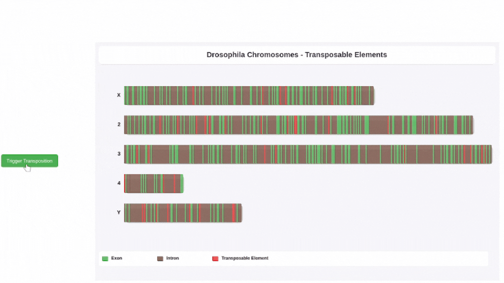

# Drosophila Transposable Elements Visualization

A dynamic, interactive visualization of transposable elements in Drosophila chromosomes, demonstrating how these "jumping genes" move between chromosomes and potentially cause mutations.

## Repository Contents

- `visualization.js` - Main JavaScript file containing the visualization code
- `index.html` - HTML file to load and display the visualization
- `README.md` - This documentation file

## Demo



## Installation

1. Clone this repository:

bash
git clone https://github.com/Jakeelamb/TE_visualization.git
cd drosophila-te-visualization

2. Open `index.html` in a web browser or serve it using a local web server:

## Usage

- The visualization loads automatically and displays Drosophila chromosomes (X, 2, 3, 4, and Y)
- Click the "Trigger Transposition" button to see a transposable element jump to a new location
- Watch for "MUTATION!" animations when transposable elements land in exons

## Features

- **Interactive Visualization**: One-click transposition events
- **Realistic Chromosome Representation**: Proper relative sizes and coloring
- **Color-Coded Genetic Elements**: 
  - Green: Exons
  - Brown: Introns
  - Red: Transposable Elements
- **3D Visual Effects**: Enhanced depth with shadows and highlights
- **Animated Transpositions**: Visual representation of element movement
- **Mutation Detection**: Dynamic animation when genes are disrupted

## Technical Implementation

- Built with p5.js for canvas-based rendering
- No external dependencies beyond p5.js
- Optimized for performance with simplified data structures
- Responsive design that adapts to different screen sizes

## Customization

You can modify the visualization by editing constants in `visualization.js`:

```javascript
// Appearance settings
const BAND_WIDTH = 3;           // Width of genetic bands
const CHROMOSOME_HEIGHT = 50;   // Height of chromosomes
const CHROMOSOME_SPACING = 30;  // Space between chromosomes
```

## Browser Compatibility

- Chrome 60+
- Firefox 60+
- Safari 12+
- Edge 79+

## License

MIT License

## Acknowledgments

- This visualization was created for educational purposes in genomics and molecular biology
- Inspired by research on transposable elements in Drosophila melanogaster